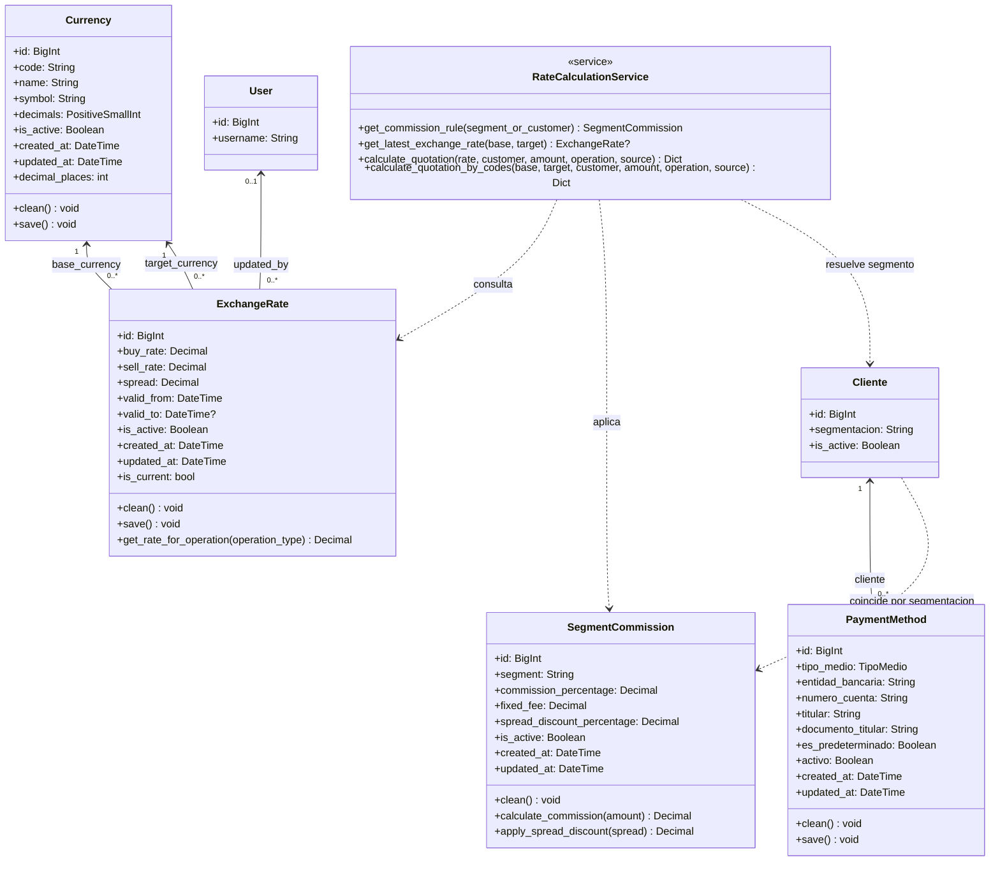

# Detalle del Diagrama de Clases — EQUIPO 88 B DIS CLA 01

> Última actualización: SCRUM 57 — incorpora las clases `Currency`, `SegmentCommission`, `PaymentMethod` y el servicio `RateCalculationService`. Expande `ExchangeRate` con par de monedas, vigencia y operador responsable.

## 1. Descripción general

El PDF presenta un **diagrama de clases UML** orientado a un sistema de gestión de clientes, usuarios/cajeros, cajas registradoras, transacciones, tipos de cambio y documentos electrónicos.

Las clases principales representadas son:

- `User`
- `Customer`
- `CustomerUserAssignment`
- `CashRegister`
- `Transaction`
- `ExchangeRate`
- `ElectronicDocument`

El modelo utiliza relaciones con multiplicidades UML como:

- `1`
- `0..1`
- `0..*`

Estas multiplicidades permiten expresar cuántas instancias de una clase pueden estar relacionadas con una instancia de otra.

---

# 2. Clase `User`

La clase `User` representa al usuario del sistema.

## Atributos

| Atributo | Tipo | Descripción |
|---|---|---|
| `keycloak_id` | `UUID` | Identificador del usuario asociado a Keycloak |
| `username` | `String` | Nombre de usuario |
| `email` | `String` | Correo electrónico |
| `first_name` | `String` | Nombre |
| `last_name` | `String` | Apellido |
| `is_active` | `Boolean` | Indica si el usuario está activo |

## Método

```text
get_realm_roles() : List
```

El método devuelve una lista de roles del usuario asociados al realm.

### Función conceptual

```text
User
 ├── keycloak_id
 ├── username
 ├── email
 ├── first_name
 ├── last_name
 ├── is_active
 └── get_realm_roles()
```

La presencia de `keycloak_id` y del método `get_realm_roles()` relaciona esta clase con el mecanismo de identidad representado anteriormente mediante Keycloak.

---

# 3. Clase `Customer`

`Customer` representa a un cliente del sistema.

## Atributos

| Atributo | Tipo | Descripción |
|---|---|---|
| `id` | `BigInt` | Identificador del cliente |
| `tax_id_ruc` | `String` | Identificador tributario/RUC |
| `name` | `String` | Nombre del cliente |
| `customer_type` | `String` | Tipo de cliente |
| `category` | `String` | Categoría del cliente |
| `is_active` | `Boolean` | Indica si el cliente está activo |

### Representación

```text
Customer
 ├── id
 ├── tax_id_ruc
 ├── name
 ├── customer_type
 ├── category
 └── is_active
```

El modelo establece relaciones entre `Customer` y:

- `CustomerUserAssignment`
- `Transaction`

---

# 4. Clase `CustomerUserAssignment`

Esta clase representa la **asignación y multi-representación entre un cliente y un usuario**.

Por su estructura y por las relaciones del dominio, funciona como la entidad intermedia de asociación fundamental entre `Customer` y `User`, permitiendo que un mismo usuario represente legal u operativamente a múltiples clientes (personas físicas o jurídicas), y que un cliente corporativo posea múltiples representantes autorizados.

## Atributos

| Atributo | Tipo | Restricción | Descripción |
|---|---|---|---|
| `id` | `BigInt` | PK, Auto | Identificador único de la asignación |
| `user` | `ForeignKey(User)` | NOT NULL, ON DELETE CASCADE | Usuario autenticado registrado en el sistema / Keycloak |
| `customer` | `ForeignKey(Customer)` | NOT NULL, ON DELETE CASCADE | Cliente (persona física o jurídica) representado |
| `is_primary_representative` | `Boolean` | Default: `False` | Indica si el usuario es el representante principal del cliente |
| `is_active` | `Boolean` | Default: `True` | Estado de vigencia de la asignación (permite revocación lógica) |
| `role_in_company` | `String(50)` | Nullable | Rol o cargo de representación (ej. "Representante Legal", "Apoderado", "Operador") |
| `assigned_at` | `DateTime` | Auto_now_add | Fecha y hora de creación de la asignación |

### Restricciones de Integridad

- **Unicidad de Asignación (`unique_together`):** Un par `(user, customer)` no puede registrarse más de una vez.
- **Unicidad de Representante Principal:** Para un mismo `customer`, solo puede existir una única asignación activa con `is_primary_representative = True`.
- **Integridad Referencial:** Eliminación en cascada (`CASCADE`): si se elimina el cliente o el usuario, sus asignaciones intermedias son depuradas automáticamente.

## Métodos y Operaciones de la Clase

| Método | Retorno | Descripción |
|---|---|---|
| `clean()` | `void` | Valida que solo exista un representante principal activo por cliente. |
| `save(*args, **kwargs)` | `void` | Ejecuta validaciones de integridad y desmarca representantes principales previos si este se define como principal. |
| `set_as_primary()` | `void` | Asigna `is_primary_representative = True` a esta instancia y actualiza a `False` las demás del cliente. |
| `deactivate()` | `void` | Inactiva la asignación (`is_active = False`) revocando permisos operativos inmediatos. |
| `activate()` | `void` | Reactiva la asignación (`is_active = True`). |
| `can_transact()` | `Boolean` | Retorna `True` si la asignación está activa y el cliente asociado está habilitado. |

### Representación

```text
CustomerUserAssignment
 ├── id: BigInt
 ├── user: ForeignKey(User)
 ├── customer: ForeignKey(Customer)
 ├── is_primary_representative: Boolean
 ├── is_active: Boolean
 ├── role_in_company: String
 └── assigned_at: DateTime
 + clean(): void
 + save(): void
 + set_as_primary(): void
 + deactivate(): void
 + activate(): void
 + can_transact(): Boolean
```

## Relación con `User` y `Customer`

```text
       1                                0..*
┌─────────────┐               ┌────────────────────────┐
│    User     │───────────────│ CustomerUserAssignment │
└─────────────┘               └────────────────────────┘
                                           │ 0..*
                                           │
                                           │ 1
                              ┌────────────────────────┐
                              │        Customer        │
                              └────────────────────────┘
```

Esto significa:
- Un `User` puede tener cero o muchas asignaciones a diferentes clientes (`0..*`).
- Un `Customer` puede tener cero o muchos usuarios asignados como representantes (`0..*`).
- Cada registro de `CustomerUserAssignment` vincula un único `User` con un único `Customer`.

---

## 4.1. Arquitectura y Reglas para la Gestión de Cliente Activo

Para posibilitar la navegación y operativa contextualizada según el cliente que el usuario esté representando en cada momento, se definen las siguientes clases y componentes de soporte:

### 1. `ActiveCustomerMiddleware`
Middleware que intercepta cada solicitud HTTP para resolver, validar e inyectar el cliente activo en el objeto `request`.

* **Atributos:**
  * `get_response: Callable`
* **Métodos:**
  * `__call__(request) -> HttpResponse`: ciclo de vida estándar de middleware Django.
  * `process_request(request) -> None`:
    1. Verifica si `request.user.is_authenticated`.
    2. Consulta la clave `active_customer_id` almacenada en `request.session`.
    3. Si existe, valida contra la base de datos que exista un `CustomerUserAssignment` con `user=request.user`, `customer_id=active_customer_id` y `is_active=True`.
    4. Si es válida, asigna `request.active_customer = customer`.
    5. Si no es válida o no existe valor en sesión, aplica la regla de resolución por defecto:
       - Selecciona el cliente donde el usuario sea `is_primary_representative=True`.
       - Si no existe principal, selecciona el primer cliente activo asignado.
       - Si el usuario no tiene asignaciones, asigna `request.active_customer = None`.
    6. Persiste el ID resuelto en `request.session['active_customer_id']`.

### 2. `active_customer_context_processor`
Context processor transversal que expone el contexto de cliente activo a todas las plantillas Django:

* **Valores inyectados al contexto:**
  * `active_customer`: instancia del `Customer` actualmente activo o `None`.
  * `user_assigned_customers`: lista de clientes activos asignados al usuario autenticado (para poblar el selector dropdown en `base.html`).
  * `has_multiple_customers`: booleano que indica si el dropdown selector debe desplegarse.

### 3. `CustomerSwitchActiveView`
Controlador (CBV o View) responsable del cambio dinámico de cliente activo:

* **Método:** `POST /customers/switch-active/<int:customer_id>/`
* **Reglas de Seguridad y Validación:**
  * Requiere usuario autenticado.
  * Comprueba rigurosamente: `CustomerUserAssignment.objects.filter(user=request.user, customer_id=customer_id, is_active=True).exists()`.
  * **Si el usuario NO posee asignación activa sobre el cliente solicitado:** Rechaza la petición con código **`HTTP 403 Forbidden`** (Prevención de suplantación IDOR).
  * **Si la asignación es válida:** Actualiza `request.session['active_customer_id'] = customer_id`.
  * Redirige al usuario a la página de origen (`HTTP_REFERER`) o al dashboard principal con un mensaje de éxito.

---

## 4.2. Componentes del Visualizador de Documentación Técnica (Sphinx)

Para integrar la documentación técnica HTML autogenerada por Sphinx dentro del portal de Global Exchange (SCRUM-32 / SCRUM-35 / SCRUM-36), se definen las siguientes clases de control y enrutamiento:

### 1. `ServeSphinxDocsView` (Vista de Documentación)
Vista especializada en servir de forma segura los archivos estáticos HTML generados en `docs/sphinx/build/html/`.

* **Atributos:**
  * `docs_root_path: Path`: Ruta absoluta/relativa al directorio de compilación HTML de Sphinx.
* **Métodos:**
  * `dispatch(request, *args, **kwargs) -> HttpResponse`: Verifica permisos de acceso (restringido a usuarios autenticados o con rol de Auditor/Administrador).
  * `get(request, path='index.html') -> HttpResponse`:
    1. Normaliza la ruta solicitada para prevenir ataques de Path Traversal (`../`).
    2. Si `path` está vacío o es un directorio, resuelve hacia `index.html`.
    3. Detecta el tipo MIME correspondiente (`text/html`, `text/css`, `application/javascript`, `image/png`, `image/svg+xml`).
    4. Retorna un `FileResponse` o `HttpResponse` con los headers adecuados de caché y seguridad.
    5. Si el archivo no existe, retorna una respuesta **`HTTP 404 Not Found`** controlada.

### 2. Integración en Navegación (`templates/base.html`)
El enlace a `/docs/` se renderiza de forma responsiva en la barra superior de navegación, permitiendo al equipo y a los auditores acceder a la documentación viva del sistema directamente desde la interfaz web.

---

# 5. Clase `CashRegister`

`CashRegister` representa una caja registradora.

## Atributos

| Atributo | Tipo | Descripción |
|---|---|---|
| `id` | `BigInt` | Identificador de la caja |
| `register_code` | `String` | Código de la caja |
| `status` | `String` | Estado de la caja |
| `initial_balances_json` | `Decimal` | Saldo inicial representado en el modelo |
| `final_balances_json` | `Decimal` | Saldo final representado en el modelo |
| `opened_at` | `DateTime` | Fecha y hora de apertura |
| `closed_at` | `DateTime` | Fecha y hora de cierre |

### Representación

```text
CashRegister
 ├── id
 ├── register_code
 ├── status
 ├── initial_balances_json
 ├── final_balances_json
 ├── opened_at
 └── closed_at
```

> **Importante:** el PDF especifica `initial_balances_json` y `final_balances_json` con tipo `Decimal`. Aunque el nombre contiene `_json`, este documento conserva exactamente el tipo indicado en el diagrama y no lo reemplaza por otro tipo.

---

# 6. Relación `User` — `CashRegister`

El diagrama conecta `User` con `CashRegister` mediante una relación denominada:

```text
cajero
```

Las multiplicidades indicadas son:

```text
User 1 ─────── 0..* CashRegister
```

Esto puede interpretarse como:

- Un usuario puede estar asociado con cero o muchas cajas registradoras.
- Cada `CashRegister` está asociada con un único `User` en esta relación.

El nombre `cajero` identifica el papel que desempeña el usuario respecto de la caja.

### Conceptualmente

```text
User
  │
  │ cajero
  │
  ├──────── CashRegister
  │
  ├──────── CashRegister
  │
  └──────── CashRegister
```

Un mismo usuario puede, según el modelo, estar asociado a múltiples cajas.

---

# 7. Clase `Transaction`

`Transaction` representa una transacción realizada dentro del sistema.

## Atributos

| Atributo | Tipo | Descripción |
|---|---|---|
| `id` | `BigInt` | Identificador de la transacción |
| `transaction_type` | `String` | Tipo de transacción |
| `amount_source` | `Decimal` | Importe en la moneda de origen |
| `amount_target` | `Decimal` | Importe en la moneda de destino |
| `applied_rate` | `Decimal` | Tasa aplicada |
| `status` | `String` | Estado de la transacción |
| `payment_method` | `String` | Método de pago |
| `created_at` | `DateTime` | Fecha y hora de creación |

### Representación

```text
Transaction
 ├── id
 ├── transaction_type
 ├── amount_source
 ├── amount_target
 ├── applied_rate
 ├── status
 ├── payment_method
 └── created_at
```

Esta es una de las clases centrales del modelo porque está relacionada con:

- `Customer`
- `CashRegister`
- `ExchangeRate`
- `ElectronicDocument`

---

# 8. Relación `Customer` — `Transaction`

El diagrama indica:

```text
Customer 1 ─────── 0..* Transaction
```

Por lo tanto:

- Un cliente puede tener cero o muchas transacciones.
- Cada transacción está asociada con un único cliente.

### Ejemplo conceptual

```text
Customer
   │
   ├── Transaction 1
   ├── Transaction 2
   ├── Transaction 3
   └── ...
```

Esto permite registrar el historial de transacciones de cada cliente.

---

# 9. Relación `CashRegister` — `Transaction`

El diagrama relaciona las cajas con las transacciones.

Las multiplicidades mostradas son:

```text
CashRegister 0..* ───── 0..1 Transaction
```

Interpretado desde el significado de las multiplicidades del diagrama:

- Una caja puede estar asociada con cero o muchas transacciones.
- Una transacción puede estar asociada con cero o una caja.

### Conceptualmente

```text
CashRegister
    │
    ├── Transaction
    ├── Transaction
    ├── Transaction
    └── ...
```

Una caja puede acumular múltiples transacciones.

---

# 10. Clase `Currency`

`Currency` representa una divisa operativa del catálogo.

## Atributos

| Atributo | Tipo | Restricción | Descripción |
|---|---|---|---|
| `id` | `BigInt` | PK, Auto | Identificador de la moneda |
| `code` | `CharField(3)` | Único, indexado | Código ISO 4217 normalizado a mayúsculas |
| `name` | `CharField(50)` | Obligatorio | Nombre descriptivo de la divisa |
| `symbol` | `CharField(10)` | Obligatorio | Símbolo de presentación |
| `decimals` | `PositiveSmallIntegerField` | 0 a 10 | Precisión monetaria |
| `is_active` | `BooleanField` | Por defecto verdadero | Habilita la moneda para cotizaciones |
| `created_at` | `DateTime` | Auto | Fecha de creación |
| `updated_at` | `DateTime` | Auto | Fecha de última actualización |

## Métodos

| Método | Retorno | Descripción |
|---|---|---|
| `clean()` | `void` | Rechaza códigos que no tengan tres letras y precisiones fuera del rango permitido. |
| `save()` | `void` | Normaliza los textos y ejecuta la validación. |
| `decimal_places` | `int` | Propiedad que devuelve la precisión monetaria. |

### Representación

```text
Currency
 ├── id
 ├── code
 ├── name
 ├── symbol
 ├── decimals
 ├── is_active
 ├── created_at
 └── updated_at
 + clean(): void
 + save(): void
 + decimal_places: int
```

---

# 11. Clase `ExchangeRate` (actualizada)

`ExchangeRate` registra una cotización de un par `base_currency`/`target_currency`.

## Atributos

| Atributo | Tipo | Restricción | Descripción |
|---|---|---|---|
| `id` | `BigInt` | PK, Auto | Identificador del registro |
| `base_currency` | `ForeignKey(Currency)` | `PROTECT` | Moneda cuya unidad se cotiza |
| `target_currency` | `ForeignKey(Currency)` | `PROTECT` | Moneda en la que se expresa el precio |
| `buy_rate` | `DecimalField(18,6)` | Mayor que cero | Precio de compra de la moneda base |
| `sell_rate` | `DecimalField(18,6)` | Mayor o igual a compra | Precio de venta de la moneda base |
| `spread` | `DecimalField(18,6)` | No editable | `sell_rate - buy_rate` |
| `valid_from` | `DateTimeField` | Obligatorio | Inicio de vigencia |
| `valid_to` | `DateTimeField` | Nullable | Fin de vigencia (posterior al inicio) |
| `is_active` | `BooleanField` | Por defecto verdadero | Estado de habilitación |
| `updated_by` | `ForeignKey(User)` | Nulo permitido, `SET_NULL` | Operador responsable |
| `created_at` | `DateTime` | Auto | Fecha de creación |
| `updated_at` | `DateTime` | Auto | Fecha de última actualización |

## Métodos

| Método | Retorno | Descripción |
|---|---|---|
| `clean()` | `void` | Valida par no idéntico, tasas positivas, venta ≥ compra y vigencia cronológica. |
| `save()` | `void` | Calcula el spread y ejecuta validación. |
| `is_current` | `bool` | Propiedad: verdadera si la tasa está activa, ya inició su vigencia y no venció. |
| `get_rate_for_operation(operation_type)` | `Decimal` | Devuelve `sell_rate` para `BUY` y `buy_rate` para `SELL`. |

### Representación

```text
ExchangeRate
 ├── id
 ├── base_currency: FK(Currency)
 ├── target_currency: FK(Currency)
 ├── buy_rate
 ├── sell_rate
 ├── spread
 ├── valid_from
 ├── valid_to
 ├── is_active
 ├── updated_by: FK(User)
 ├── created_at
 └── updated_at
 + clean(): void
 + save(): void
 + is_current: bool
 + get_rate_for_operation(): Decimal
```

---

# 11b. Clase `SegmentCommission`

`SegmentCommission` parametriza las condiciones comerciales de un segmento de `Cliente`.

## Atributos

| Atributo | Tipo | Restricción | Descripción |
|---|---|---|---|
| `id` | `BigInt` | PK, Auto | Identificador |
| `segment` | `CharField(3)` | Único | Código de `Cliente.Segmentacion` |
| `commission_percentage` | `DecimalField(5,2)` | 0 a 100 | Comisión sobre el monto bruto |
| `fixed_fee` | `DecimalField(12,2)` | ≥ 0 | Cargo administrativo fijo |
| `spread_discount_percentage` | `DecimalField(5,2)` | 0 a 100 | Bonificación sobre el spread |
| `is_active` | `BooleanField` | Por defecto verdadero | Vigencia de la política |
| `created_at` | `DateTime` | Auto | Fecha de creación |
| `updated_at` | `DateTime` | Auto | Fecha de última actualización |

## Métodos

| Método | Retorno | Descripción |
|---|---|---|
| `clean()` | `void` | Valida rangos de porcentaje y cargo fijo. |
| `calculate_commission(amount)` | `Decimal` | Retorna el componente porcentual más el fijo cuando la regla está activa. |
| `apply_spread_discount(spread)` | `Decimal` | Reduce el spread sin permitir resultados negativos. |

### Representación

```text
SegmentCommission
 ├── id
 ├── segment
 ├── commission_percentage
 ├── fixed_fee
 ├── spread_discount_percentage
 ├── is_active
 ├── created_at
 └── updated_at
 + clean(): void
 + calculate_commission(amount): Decimal
 + apply_spread_discount(spread): Decimal
```

No existe una clave foránea entre cliente y regla de comisión: la asociación se resuelve por el valor de `segmentacion`. Funcionalmente, un segmento tiene cero o una regla por la unicidad de `SegmentCommission.segment`.

---

# 12. Relación `ExchangeRate` — `Transaction`

El diagrama muestra:

```text
ExchangeRate 1 ─────── 0..* Transaction
```

Esto indica:

- Un registro de `ExchangeRate` puede estar relacionado con cero o muchas transacciones.
- Cada `Transaction` está relacionada con un único `ExchangeRate` según la multiplicidad mostrada.

### Relaciones adicionales de `ExchangeRate` (SCRUM 57)

- Una `Currency` puede ser base o destino en muchas tasas, pero cada tasa referencia exactamente una base y un destino.
- La eliminación de una moneda con tasas relacionadas está protegida por `PROTECT`.
- `User` (0..1) puede ser el `updated_by` de muchas tasas.

---

# 12b. Clase `PaymentMethod`

`PaymentMethod` identifica un instrumento de pago perteneciente a una sola ficha de cliente.

## Atributos

| Atributo | Tipo | Restricción | Descripción |
|---|---|---|---|
| `id` | `BigInt` | PK, Auto | Identificador |
| `cliente` | `ForeignKey(Cliente)` | `CASCADE` | Titular del medio de pago |
| `tipo_medio` | `TextChoices` | Obligatorio | Transferencia, billetera, tarjeta, efectivo u otro |
| `entidad_bancaria` | `CharField(100)` | No vacío | Banco, cooperativa o proveedor |
| `numero_cuenta` | `CharField(50)` | No vacío | Cuenta o teléfono de billetera |
| `titular` | `CharField(150)` | No vacío | Titular o razón social |
| `documento_titular` | `CharField(30)` | Opcional | CI o RUC informado |
| `es_predeterminado` | `BooleanField` | Uno por cliente | Preferencia para liquidaciones |
| `activo` | `BooleanField` | Predeterminado verdadero | Habilitación lógica |
| `created_at` | `DateTime` | Auto | Fecha de creación |
| `updated_at` | `DateTime` | Auto | Fecha de última actualización |

## Métodos

| Método | Retorno | Descripción |
|---|---|---|
| `clean()` | `void` | Valida que un medio inactivo no pueda ser predeterminado. |
| `save()` | `void` | Dentro de una transacción atómica, desmarca otros medios predeterminados del mismo cliente. |

### Representación

```text
PaymentMethod
 ├── id
 ├── cliente: FK(Cliente)
 ├── tipo_medio
 ├── entidad_bancaria
 ├── numero_cuenta
 ├── titular
 ├── documento_titular
 ├── es_predeterminado
 ├── activo
 ├── created_at
 └── updated_at
 + clean(): void
 + save(): void
```

Un cliente tiene cero o muchos medios de pago; un medio pertenece a exactamente un cliente y se elimina si se elimina ese cliente (`CASCADE`).

---

# 12c. Servicio `RateCalculationService`

`RateCalculationService` es un servicio (no persistente) que encapsula la lógica del cotizador.

## Métodos

| Método | Retorno | Descripción |
|---|---|---|
| `get_commission_rule(segment_or_customer)` | `SegmentCommission` | Busca la regla activa del segmento; si no la encuentra crea una regla neutral en memoria. |
| `get_latest_exchange_rate(base, target)` | `ExchangeRate?` | Busca la tasa activa más reciente para el par de códigos solicitado. |
| `calculate_quotation(rate, customer, amount, operation, source)` | `Dict` | Calcula la cotización completa con todos los componentes. |
| `calculate_quotation_by_codes(base, target, customer, amount, operation, source)` | `Dict` | Variante que resuelve el par por códigos ISO. |

### Lógica de operación

| Operación | Tasa oficial | Ajuste por bonificación | Comisión | Monto neto |
|---|---|---|---|---|
| `BUY` | `sell_rate` | Reduce la tasa efectiva | Se suma | Total que paga el cliente |
| `SELL` | `buy_rate` | Aumenta la tasa efectiva | Se resta | Total que recibe el cliente |

El servicio usa las entidades anteriores sin crear asociaciones persistentes entre una cotización informativa y un medio de pago.

---

# 13. Clase `ElectronicDocument`

`ElectronicDocument` representa un documento electrónico asociado a una transacción.

## Atributos

| Atributo | Tipo | Descripción |
|---|---|---|
| `id` | `BigInt` | Identificador del documento |
| `document_type` | `String` | Tipo de documento |
| `cdc_number` | `String` | Número CDC |
| `xml_content` | `String` | Contenido XML |
| `sifen_status` | `String` | Estado en SIFEN |
| `issued_at` | `DateTime` | Fecha y hora de emisión |

### Representación

```text
ElectronicDocument
 ├── id
 ├── document_type
 ├── cdc_number
 ├── xml_content
 ├── sifen_status
 └── issued_at
```

El atributo `sifen_status` muestra que el modelo contempla un estado relacionado con SIFEN.

---

# 14. Relación `Transaction` — `ElectronicDocument`

El diagrama muestra:

```text
Transaction 1 ─────── 0..1 ElectronicDocument
```

Esto significa:

- Una `Transaction` puede tener cero o un `ElectronicDocument`.
- Cada `ElectronicDocument` está asociado con una única `Transaction`.

Por lo tanto, una transacción puede existir sin que exista todavía un documento electrónico asociado.

---

# 15. Diagrama UML actualizado (SCRUM 57)



---

# 16. Mapa general de relaciones

El modelo completo puede resumirse de la siguiente manera:

```text
                         ┌──────────────┐
                         │     User     │
                         └──────┬───────┘
                                │
                    cajero      │ 1          updated_by 0..1
                                │                  │
                              0..*                 │
                                │                  │
                         ┌──────▼───────┐   ┌──────▼───────┐
                         │ CashRegister │   │ ExchangeRate │
                         └──────┬───────┘   └───┬──────┬───┘
                                │               │      │
                              0..*            FK│    FK│
                                │               │      │
                         ┌──────▼───────┐   ┌───▼──────▼───┐
                         │ Transaction  │   │   Currency   │
                         └───┬────┬─────┘   └──────────────┘
                             │    │
                  0..1       │    │       0..1
                             │    ▼
                             │ ElectronicDocument
                             │
                         0..*│
                             │
                       ┌─────▼──────┐
                       │  Customer  │──────────── segmentacion
                       └─────┬──┬───┘                  │
                             │  │                      ▼
                           0..*│              SegmentCommission
                             │  │
                 ┌───────────▼──┘──────────┐
                 │ CustomerUserAssignment  │
                 └───────────┬────────────┘
                             │                ┌───────────────┐
                           0..*               │ PaymentMethod │
                             │                └───────────────┘
                            User                    │
                                              Cliente 1 ── 0..*
```

---

# 15. Vista simplificada del modelo

```text
User
 │
 ├───────────────< CashRegister
 │                      │
 │                      │
 │                      └───────────────< Transaction
 │                                              │
 │                                              ├──> ElectronicDocument
 │                                              │
 │                                              └──> ExchangeRate
 │
 └───────────────< CustomerUserAssignment >────────────── Customer
                                                         │
                                                         └──< Transaction
```

Donde:

```text
1 ─── 0..*
```

representa una relación de uno a muchos.

Y:

```text
1 ─── 0..1
```

representa una relación en la que el lado correspondiente permite cero o una instancia.

---

# 16. Interpretación funcional

A partir exclusivamente de los elementos mostrados en el diagrama, el sistema puede entenderse en los siguientes bloques.

## 16.1 Gestión de usuarios

`User` contiene la información básica del usuario:

```text
Keycloak ID
Username
Email
Nombre
Apellido
Estado
```

Además permite consultar los roles del realm mediante:

```text
get_realm_roles()
```

---

## 16.2 Gestión de clientes

`Customer` almacena:

```text
Identificador
RUC
Nombre
Tipo
Categoría
Estado
```

Los clientes pueden estar relacionados con usuarios mediante:

```text
CustomerUserAssignment
```

---

## 16.3 Representación de responsables

`CustomerUserAssignment` permite representar qué usuario está asignado a qué cliente.

El atributo:

```text
is_primary_representative
```

permite identificar si el usuario correspondiente es el representante principal.

El atributo:

```text
assigned_at
```

registra cuándo se produjo la asignación.

---

## 16.4 Gestión de cajas

`CashRegister` representa una caja con:

- Código.
- Estado.
- Saldo inicial.
- Saldo final.
- Fecha de apertura.
- Fecha de cierre.

Además, la relación con `User` está identificada mediante el rol:

```text
cajero
```

---

## 16.5 Gestión de transacciones

`Transaction` registra los principales datos de una operación:

```text
Tipo
Monto origen
Monto destino
Tasa aplicada
Estado
Método de pago
Fecha de creación
```

Y se relaciona con:

```text
Customer
CashRegister
ExchangeRate
ElectronicDocument
```

---

## 16.6 Gestión de tipos de cambio

`ExchangeRate` contiene:

```text
Moneda
Tasa de compra
Tasa de venta
Spread
Fecha de actualización
```

Las tasas pueden estar relacionadas con múltiples transacciones.

---

## 16.7 Documentación electrónica

`ElectronicDocument` almacena información del documento generado o asociado a una transacción:

```text
Tipo de documento
CDC
Contenido XML
Estado SIFEN
Fecha de emisión
```

Una transacción puede tener como máximo un documento electrónico según la multiplicidad indicada.

---

# 17. Posible flujo de negocio representado

El diagrama permite visualizar un flujo conceptual como:

```text
USER
 │
 │ actúa como cajero
 ▼
CASH REGISTER
 │
 │ registra
 ▼
TRANSACTION
 │
 ├──────────────► CUSTOMER
 │
 ├──────────────► EXCHANGE RATE
 │
 └──────────────► ELECTRONIC DOCUMENT
```

Paralelamente:

```text
USER
 │
 │ asignación
 ▼
CUSTOMER
```

mediante:

```text
CustomerUserAssignment
```

---

# 18. Tipos de datos utilizados

El diagrama utiliza los siguientes tipos:

| Tipo | Clases donde aparece |
|---|---|
| `UUID` | `User` |
| `String` | `User`, `Customer`, `Currency`, `CashRegister`, `Transaction`, `ExchangeRate`, `SegmentCommission`, `PaymentMethod`, `ElectronicDocument` |
| `Boolean` | `User`, `Customer`, `Currency`, `CustomerUserAssignment`, `ExchangeRate`, `SegmentCommission`, `PaymentMethod` |
| `BigInt` | `Customer`, `CustomerUserAssignment`, `Currency`, `CashRegister`, `Transaction`, `ExchangeRate`, `SegmentCommission`, `PaymentMethod`, `ElectronicDocument` |
| `Decimal` | `CashRegister`, `Transaction`, `ExchangeRate`, `SegmentCommission`, `PaymentMethod` |
| `DateTime` | `CustomerUserAssignment`, `Currency`, `CashRegister`, `Transaction`, `ExchangeRate`, `SegmentCommission`, `PaymentMethod`, `ElectronicDocument` |
| `List` | Retorno de `User.get_realm_roles()` |
| `TextChoices` | `PaymentMethod` |
| `Dict` | Retorno de `RateCalculationService` |

---

# 19. Identificadores

Todas las clases principales, excepto `User` que utiliza explícitamente `keycloak_id`, presentan un atributo:

```text
id : BigInt
```

Las clases que contienen `id : BigInt` son:

- `Customer`
- `CustomerUserAssignment`
- `CashRegister`
- `Transaction`
- `ExchangeRate`
- `ElectronicDocument`

En `User`, el identificador mostrado es:

```text
keycloak_id : UUID
```

---

# 20. Relaciones resumidas en tabla

| Clase origen | Relación | Clase destino | Multiplicidad representada |
|---|---|---|---|
| `User` | asignación | `CustomerUserAssignment` | `1` → `0..*` |
| `Customer` | asignación | `CustomerUserAssignment` | `1` → `0..*` |
| `User` | `cajero` | `CashRegister` | `1` → `0..*` |
| `Customer` | tiene | `Transaction` | `1` → `0..*` |
| `CashRegister` | registra | `Transaction` | `0..*` / `0..1` |
| `Currency` | `base_currency` | `ExchangeRate` | `1` → `0..*` |
| `Currency` | `target_currency` | `ExchangeRate` | `1` → `0..*` |
| `User` | `updated_by` | `ExchangeRate` | `0..1` → `0..*` |
| `ExchangeRate` | asociada | `Transaction` | `1` → `0..*` |
| `Transaction` | genera/asocia | `ElectronicDocument` | `1` → `0..1` |
| `Customer` | titular | `PaymentMethod` | `1` → `0..*` |
| `Customer` | segmentación | `SegmentCommission` | coincide por valor (0..1) |
| `RateCalculationService` | consulta | `ExchangeRate` | dependencia |
| `RateCalculationService` | aplica | `SegmentCommission` | dependencia |
| `RateCalculationService` | resuelve | `Cliente` | dependencia |

> La tabla conserva las multiplicidades visibles en el diagrama. Las relaciones del SCRUM 57 incluyen las nuevas clases `Currency`, `SegmentCommission`, `PaymentMethod` y `RateCalculationService`.

---

# 21. Modelo de entidades para una implementación de base de datos

Sin agregar campos que no aparecen en el PDF, las entidades podrían organizarse conceptualmente así:

```text
USER
 ├── keycloak_id
 ├── username
 ├── email
 ├── first_name
 ├── last_name
 └── is_active

CUSTOMER
 ├── id
 ├── tax_id_ruc
 ├── name
 ├── customer_type
 ├── category
 └── is_active

CUSTOMER_USER_ASSIGNMENT
 ├── id
 ├── is_primary_representative
 └── assigned_at

CASH_REGISTER
 ├── id
 ├── register_code
 ├── status
 ├── initial_balances_json
 ├── final_balances_json
 ├── opened_at
 └── closed_at

TRANSACTION
 ├── id
 ├── transaction_type
 ├── amount_source
 ├── amount_target
 ├── applied_rate
 ├── status
 ├── payment_method
 └── created_at

EXCHANGE_RATE
 ├── id
 ├── currency_code
 ├── buy_rate
 ├── sell_rate
 ├── spread
 └── updated_at

ELECTRONIC_DOCUMENT
 ├── id
 ├── document_type
 ├── cdc_number
 ├── xml_content
 ├── sifen_status
 └── issued_at
```

---

# 22. Puntos importantes para estudiar el diagrama

## `User`

Recordar:

```text
keycloak_id : UUID
```

y:

```text
get_realm_roles() : List
```

Es la clase vinculada explícitamente con Keycloak.

---

## `Customer`

Recordar los datos:

```text
tax_id_ruc
customer_type
category
is_active
```

---

## `CustomerUserAssignment`

Es especialmente importante porque funciona como asociación entre:

```text
User ↔ Customer
```

y contiene:

```text
is_primary_representative
assigned_at
```

---

## `CashRegister`

Sus campos principales son:

```text
register_code
status
initial_balances_json
final_balances_json
opened_at
closed_at
```

y está asociada a un `User` mediante el rol:

```text
cajero
```

---

## `Transaction`

Es una clase central del modelo.

Contiene:

```text
transaction_type
amount_source
amount_target
applied_rate
status
payment_method
created_at
```

y está relacionada con cliente, caja, tipo de cambio y documento electrónico.

---

## `ExchangeRate`

Recordar:

```text
currency_code
buy_rate
sell_rate
spread
updated_at
```

---

## `ElectronicDocument`

Recordar:

```text
document_type
cdc_number
xml_content
sifen_status
issued_at
```

Está asociada opcionalmente a una transacción:

```text
Transaction 1 ─── 0..1 ElectronicDocument
```

---

# 23. Resumen final

El diagrama define un modelo centrado en **clientes y transacciones**, con usuarios que pueden actuar como cajeros y que también pueden ser asignados a clientes. La actualización del SCRUM 57 incorpora las entidades de parametrización financiera (`Currency`, `ExchangeRate` expandido, `SegmentCommission`), medios de pago (`PaymentMethod`) y el servicio de cálculo del cotizador (`RateCalculationService`).

En términos de responsabilidades:

- **`User`** → identidad y roles.
- **`Customer`** → información del cliente y segmentación.
- **`CustomerUserAssignment`** → relación/asignación usuario-cliente.
- **`CashRegister`** → gestión de cajas.
- **`Transaction`** → operaciones realizadas.
- **`Currency`** → catálogo de divisas operativas.
- **`ExchangeRate`** → tasas de cambio con par de monedas, vigencia y operador responsable.
- **`SegmentCommission`** → condiciones comerciales por segmento de cliente.
- **`PaymentMethod`** → instrumentos de pago por cliente.
- **`RateCalculationService`** → lógica de cotización neta (no persistente).
- **`ElectronicDocument`** → documentación electrónica asociada a transacciones.

> **Alcance:** este documento se basa en los elementos visibles del PDF e incorpora las clases y relaciones del SCRUM 57 para los módulos `rates` y `payments`.
