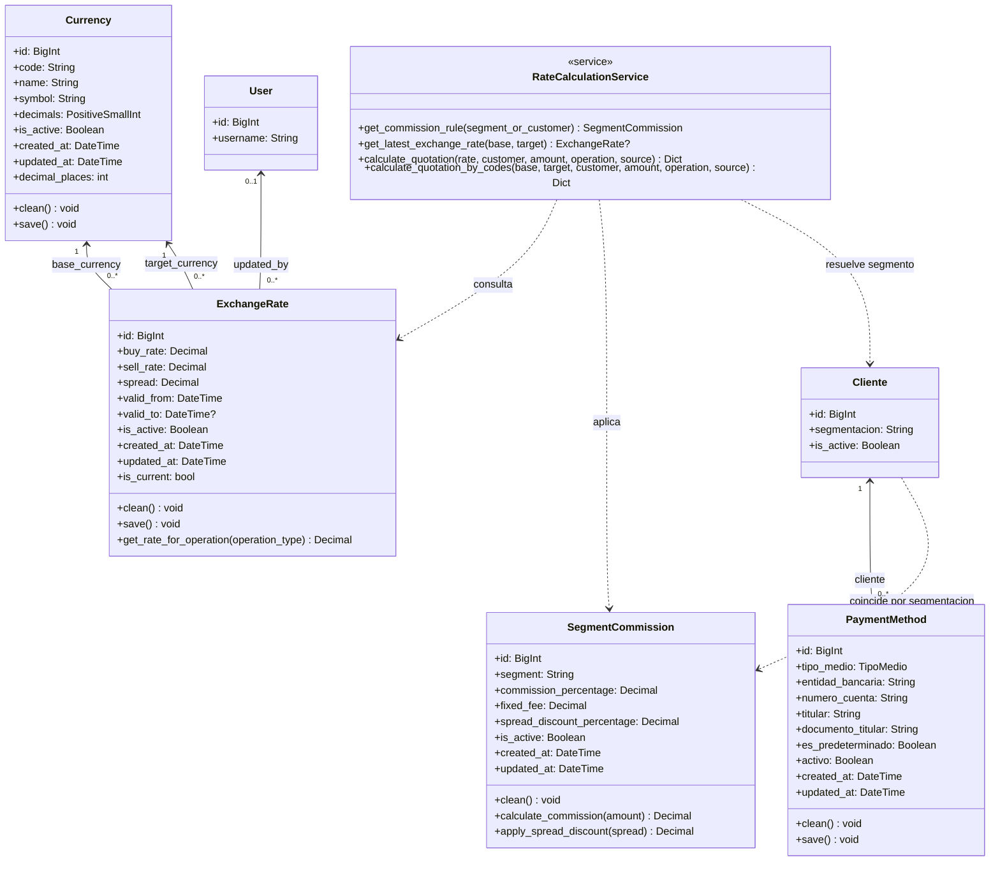

# Diagrama de Clases DIS CLA 01 Actualizacion SCRUM 57

## 1. Proposito y alcance

Este documento actualiza el modelo de clases para los modulos `rates` y `payments`. El diagrama describe las entidades persistentes, el servicio de calculo del cotizador y sus relaciones con `Cliente` y `User`. Las clases existentes de transacciones no se modifican en este hito.

## 2. Diagrama UML actualizado

## 3. Clases del modulo rates

### 3.1 Currency

`Currency` representa una divisa operativa del catalogo.

| Atributo | Tipo | Restriccion | Descripcion |
|---|---|---|---|
| `code` | `CharField(3)` | Unico, indexado | Codigo ISO 4217 normalizado a mayusculas. |
| `name` | `CharField(50)` | Obligatorio | Nombre descriptivo de la divisa. |
| `symbol` | `CharField(10)` | Obligatorio | Simbolo de presentacion. |
| `decimals` | `PositiveSmallIntegerField` | 0 a 10 | Precision monetaria. |
| `is_active` | `BooleanField` | Por defecto verdadero | Habilita la moneda para cotizaciones. |

`clean()` rechaza codigos que no tengan tres letras y precisiones fuera del rango permitido. `save()` normaliza los textos y ejecuta la validacion.

### 3.2 ExchangeRate

`ExchangeRate` registra una cotizacion de un par `base_currency/target_currency`.

| Atributo | Tipo | Restriccion | Descripcion |
|---|---|---|---|
| `base_currency` | `ForeignKey(Currency)` | `PROTECT` | Moneda cuya unidad se cotiza. |
| `target_currency` | `ForeignKey(Currency)` | `PROTECT` | Moneda en la que se expresa el precio. |
| `buy_rate` | `DecimalField(18,6)` | Mayor que cero | Precio de compra de la moneda base. |
| `sell_rate` | `DecimalField(18,6)` | Mayor o igual a compra | Precio de venta de la moneda base. |
| `spread` | `DecimalField(18,6)` | No editable | `sell_rate - buy_rate`. |
| `valid_from`, `valid_to` | `DateTimeField` | Fin posterior al inicio | Intervalo de vigencia. |
| `updated_by` | `ForeignKey(User)` | Nulo permitido, `SET_NULL` | Operador responsable. |

La propiedad `is_current` es verdadera solo si la tasa esta activa, ya inicio su vigencia y no vencio. `get_rate_for_operation()` devuelve `sell_rate` para `BUY` y `buy_rate` para `SELL`.

### 3.3 SegmentCommission

`SegmentCommission` parametriza las condiciones comerciales de un segmento de `Cliente`.

| Atributo | Tipo | Restriccion | Descripcion |
|---|---|---|---|
| `segment` | `CharField(3)` | Unico | Codigo de `Cliente.Segmentacion`. |
| `commission_percentage` | `DecimalField(5,2)` | 0 a 100 | Comision sobre el monto bruto. |
| `fixed_fee` | `DecimalField(12,2)` | Mayor o igual a cero | Cargo administrativo fijo. |
| `spread_discount_percentage` | `DecimalField(5,2)` | 0 a 100 | Bonificacion sobre el spread. |
| `is_active` | `BooleanField` | Por defecto verdadero | Vigencia de la politica. |

`calculate_commission()` retorna el componente porcentual mas el fijo cuando la regla esta activa. `apply_spread_discount()` reduce el spread sin permitir resultados negativos.

## 4. Clase del modulo payments

### 4.1 PaymentMethod

`PaymentMethod` identifica un instrumento de pago perteneciente a una sola ficha de cliente.

| Atributo | Tipo | Restriccion | Descripcion |
|---|---|---|---|
| `cliente` | `ForeignKey(Cliente)` | `CASCADE` | Titular del medio de pago. |
| `tipo_medio` | `TextChoices` | Obligatorio | Transferencia, billetera, tarjeta, efectivo u otro. |
| `entidad_bancaria` | `CharField(100)` | No vacio | Banco, cooperativa o proveedor. |
| `numero_cuenta` | `CharField(50)` | No vacio | Cuenta o telefono de billetera. |
| `titular` | `CharField(150)` | No vacio | Titular o razon social. |
| `documento_titular` | `CharField(30)` | Opcional | CI o RUC informado. |
| `es_predeterminado` | `BooleanField` | Uno por cliente | Preferencia para liquidaciones. |
| `activo` | `BooleanField` | Predeterminado verdadero | Habilitacion logica. |

`save()` valida la instancia y, dentro de una transaccion atomica, desmarca otros medios predeterminados del mismo cliente. Un medio inactivo no puede ser predeterminado.

## 5. Servicio del cotizador

`RateCalculationService` no persiste datos. Recibe una tasa vigente, el cliente o segmento, el monto, el tipo de operacion y la moneda de origen del importe. Devuelve una estructura con todos los componentes de calculo.

| Operacion | Tasa oficial | Ajuste por bonificacion | Comision | Monto neto |
|---|---|---|---|---|
| `BUY` | `sell_rate` | Reduce la tasa efectiva | Se suma | Total que paga el cliente |
| `SELL` | `buy_rate` | Aumenta la tasa efectiva | Se resta | Total que recibe el cliente |

La clase busca la regla activa del segmento; si no la encuentra crea una regla neutral en memoria. Tambien busca la tasa activa mas reciente para el par de codigos solicitado.

## 6. Restricciones y multiplicidades

- Una moneda puede ser base o destino en muchas tasas, pero cada tasa referencia exactamente una base y un destino.
- La eliminacion de una moneda con tasas relacionadas esta protegida por `PROTECT`.
- Un cliente tiene cero o muchos medios de pago; un medio pertenece a exactamente un cliente y se elimina si se elimina ese cliente.
- No existe una clave foranea entre cliente y regla de comision: la asociacion se resuelve por el valor de `segmentacion`. Funcionalmente, un segmento tiene cero o una regla por la unicidad de `SegmentCommission.segment`.
- El servicio usa las entidades anteriores sin crear asociaciones persistentes entre una cotizacion informativa y un medio de pago.
