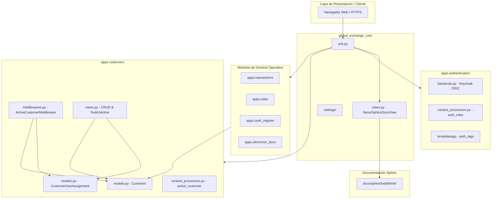

# Descripción detallada del diagrama de arquitectura

## 1. Identificación general

El documento presenta un diagrama de arquitectura de software para el proyecto **Django (Global Exchange)**. La solución está organizada como un proyecto Django compuesto por varias aplicaciones funcionales y un núcleo central de configuración y enrutamiento.

El diagrama muestra módulos, archivos principales y relaciones de dependencia o comunicación entre ellos. La arquitectura separa responsabilidades de negocio, autenticación, integración externa y configuración global.

> Nota: el PDF está compuesto por una imagen y no contiene texto seleccionable; la descripción se elaboró a partir de la información visible en el diagrama.

## 2. Estructura general

El proyecto se divide visualmente en los siguientes componentes:

- `apps.electronic_docs`.
- `apps.transactions`.
- `apps.customers`.
- `apps.cash_register`.
- `apps.rates`.
- `apps.authentication`.
- `global_exchange_core`.

La aplicación `apps.transactions` aparece como el punto central de interacción del dominio operativo. Se relaciona con clientes, cajas registradoras y tasas de cambio, mientras que también recibe información o servicios asociados a documentos electrónicos.

## 3. Aplicación `apps.electronic_docs`

Este módulo concentra la gestión de documentos electrónicos y la comunicación con servicios externos relacionados con SIFEN/DNIT.

### Componentes

- `models.py (ElectronicDocument)`: define el modelo de datos utilizado para representar documentos electrónicos.
- `sifen_client.py (API SIFEN/DNIT)`: encapsula la integración con la API de SIFEN/DNIT. Su responsabilidad probable es enviar, consultar o procesar documentos electrónicos frente al servicio tributario externo.

### Relación principal

`apps.electronic_docs` se conecta con `apps.transactions`, lo que indica que las transacciones pueden generar, asociar o requerir documentos electrónicos.

## 4. Aplicación `apps.transactions`

Este módulo representa el núcleo del flujo comercial o financiero de la aplicación.

### Componentes

- `models.py (Transaction)`: define la entidad persistente que representa una transacción.
- `views.py (Compra/Venta, Cotizador)`: contiene las vistas relacionadas con operaciones de compra, venta y cotización.

### Relaciones

Desde `apps.transactions` se observan conexiones hacia:

- `apps.customers`, para asociar las operaciones con clientes.
- `apps.cash_register`, para registrar o controlar operaciones de caja.
- `apps.rates`, para utilizar tasas o tipos de cambio.
- `apps.electronic_docs`, para vincular transacciones con documentos electrónicos.

Por su posición en el diagrama, este módulo coordina buena parte del proceso de negocio.

## 5. Aplicación `apps.customers`

Este módulo administra clientes, la multi-representación de usuarios y la contextualización del cliente activo para las operaciones del sistema.

### Componentes

- `models.py (Customer, CustomerUserAssignment)`:
  - `Customer`: entidad que representa a la persona física o jurídica (Minorista, Mayorista, Corporativo, VIP).
  - `CustomerUserAssignment`: entidad asociativa intermedia que materializa la relación N:M entre `User` y `Customer`. Registra `user`, `customer`, `is_primary_representative`, `assigned_at`, `is_active` y el rol corporativo, posibilitando que un usuario opere en nombre de varios clientes y que una empresa tenga múltiples representantes autorizados.
- `middlewares.py (ActiveCustomerMiddleware)`: intercepta cada petición HTTP, evalúa el `active_customer_id` en la sesión del usuario, valida que exista una asignación activa en `CustomerUserAssignment` e inyecta la instancia `request.active_customer`. Aplica selección automática por defecto (representante principal) si no hay selección explícita.
- `context_processors.py (active_customer_context)`: inyecta en el contexto global de las plantillas el cliente activo actual (`active_customer`) y la lista de clientes disponibles (`user_assigned_customers`) para alimentar el selector dinámico del navbar.
- `views.py (Customer Management & Switch Active)`:
  - Vistas CBVs para el ciclo de vida del cliente (listado con filtros por segmento, creación, detalle, edición y baja).
  - `CustomerSwitchActiveView`: endpoint seguro que valida permisos de asignación activa y actualiza el cliente activo en sesión, retornando `HTTP 403 Forbidden` si un usuario intenta operar un cliente no asignado.

### Relaciones del paquete

- **Con `apps.authentication`**: vincula identidades de usuarios autenticados con sus clientes representados a través de `CustomerUserAssignment`.
- **Con `global_exchange_core`**: registra el middleware y el context processor en el pipeline de ejecución de Django.
- **Con `apps.transactions`**: suministra el cliente activo bajo el cual se registran y facturan las cotizaciones y operaciones cambiarias.

## 6. Aplicación `apps.cash_register`

Este módulo gestiona la apertura, arqueo y cierre de cajas registradoras.

### Componentes

- `models.py (CashRegister)`: define la entidad que representa una caja registradora o sesión de caja.
- `views.py (Apertura, Arqueo, Cierre)`: implementa las operaciones de apertura de caja, arqueo y cierre.

### Relaciones

`apps.cash_register` se relaciona con `apps.transactions`, dado que las operaciones de compra y venta deben afectar una caja o quedar asociadas a ella. También se conecta con `apps.authentication`, probablemente para validar el usuario responsable de cada operación y aplicar permisos.

## 7. Aplicación `apps.rates`

Este módulo administra las tasas de cambio utilizadas por el sistema.

### Componentes

- `models.py (ExchangeRate)`: define el modelo de tasa de cambio.
- `views.py (Rates & Dashboard)`: proporciona vistas para consultar o administrar tasas y visualizar un panel o dashboard.

### Relación principal

La conexión con `apps.transactions` indica que las tasas de cambio son utilizadas durante la cotización, compra o venta.

## 8. Aplicación `apps.authentication`

Este módulo centraliza la autenticación, autorización y resolución de privilegios basada en roles JWT.

### Componentes

- `middlewares.py (JWT Bearer Validation)`: intercepta solicitudes API y valida tokens JWT enviados mediante esquema Bearer.
- `backends.py (Keycloak OIDC)`: integra el sistema con Keycloak mediante OpenID Connect, gestionando la sincronización de identidades y claims del usuario.
- `context_processors.py (auth_roles)`: inyecta en plantillas los roles extraídos del token JWT (`is_admin`, `is_operator`, `is_auditor`, etc.).
- `templatetags/auth_tags.py`: etiquetas personalizadas (`has_role`, `has_any_role`) para renderizado condicional de componentes en `templates/base.html`.

### Relación con el núcleo global

`apps.authentication` se comunica con `global_exchange_core`, proveyendo los backends de autenticación y los middlewares de seguridad.

## 9. Paquete `global_exchange_core`

Este paquete contiene la configuración transversal del proyecto Django y servicios globales de plataforma.

### Componentes

- `settings.py (Configuración Multientorno)`:
  - `base.py`: configuración común, registro de aplicaciones, middlewares y context processors.
  - `dev.py` / `prod.py`: entornos de persistencia con PostgreSQL y Keycloak.
  - `test.py`: entorno optimizado in-memory SQLite para ejecución rápida de tests unitarios y cobertura.
- `urls.py (Root Routing)`: define el enrutamiento raíz conectando las rutas de autenticación, clientes, transacciones y documentación.
- `views.py (ServeSphinxDocsView)`: vista especializada para servir de manera integrada y protegida la documentación técnica generada por Sphinx (`docs/sphinx/build/html/`), con verificación de tipos MIME y mitigación de Path Traversal.
- `wsgi.py / asgi.py`: puntos de entrada para servidores de producción (Gunicorn / Uvicorn).

## 10. Flujo funcional inferido

El flujo general del sistema incorpora la multi-representación y la consulta técnica:

1. **Autenticación e Identidad:** El usuario inicia sesión vía Keycloak OIDC. El backend valida el token JWT y extrae los roles y el UUID (`sub`).
2. **Resolución de Cliente Activo:**
   - `ActiveCustomerMiddleware` verifica las asignaciones en `CustomerUserAssignment`.
   - Si el usuario representa a varios clientes, se inyecta la lista de representados en el selector del navbar (`base.html`).
   - El usuario puede alternar de cliente en cualquier momento mediante `CustomerSwitchActiveView`, actualizando la sesión de forma atómica.
3. **Operativa Comercial Contextualizada:** Las compras, ventas y cotizaciones en `apps.transactions` se imputan automáticamente al cliente activo en la sesión.
4. **Acceso a Documentación Técnica:** A través del menú superior, los usuarios autorizados o desarrolladores pueden acceder a `/docs/`, donde `ServeSphinxDocsView` sirve los documentos HTML autogenerados.

## 11. Responsabilidades por capa

| Área | Componentes Clave | Responsabilidad |
|---|---|---|
| **Multi-Representación** | `CustomerUserAssignment`, `ActiveCustomerMiddleware` | Gestionar relaciones N:M usuario-cliente y mantener el cliente activo en sesión. |
| **Modelos de Dominio** | `Customer`, `Transaction`, `CashRegister`, `ExchangeRate`, `ElectronicDocument` | Persistir entidades de negocio y reglas de consistencia de datos. |
| **Vistas e Interfaces** | `CustomerViews`, `CustomerSwitchActiveView`, `base.html` | Exponer interfaces responsivas, selectores dinámicos y endpoints REST. |
| **Documentación Integrada** | `ServeSphinxDocsView`, `docs/sphinx/` | Servir la documentación técnica del código de forma segura y accesible. |
| **Seguridad y Roles** | `Keycloak OIDC`, `auth_roles`, `JWT Bearer` | Centralizar identidades y gobernar permisos por rol en backend y frontend. |
| **Configuración y Rutas** | `global_exchange_core` | Coordinar settings por ambiente (dev/prod/test) y resolver el árbol de URLs. |
| **Integraciones Externas** | `sifen_client.py`, `Keycloak OIDC` | Comunicarse con servicios tributarios (SIFEN/DNIT) y servidor IAM. |
| **Despliegue y Ejecución** | `wsgi.py`, `asgi.py`, `Docker` | Proveer puntos de entrada para servidores WSGI/ASGI y orquestación. |

## 12. Observaciones de arquitectura

- La separación en aplicaciones Django favorece la modularidad y delimita las responsabilidades del dominio.
- `apps.transactions` parece actuar como coordinador de los principales procesos operativos.
- La autenticación está desacoplada de las aplicaciones de negocio mediante middleware y backend propios.
- Keycloak proporciona un mecanismo centralizado de identidad, mientras que JWT permite proteger las solicitudes de la API.
- La integración con SIFEN/DNIT está aislada en un cliente específico, lo que facilita el mantenimiento y las pruebas.
- La presencia simultánea de WSGI y ASGI permite soportar despliegues tradicionales y escenarios compatibles con ejecución asíncrona.

## 13. Conclusión

El diagrama describe una arquitectura Django modular para una plataforma de intercambio o gestión financiera denominada **Global Exchange**. El sistema integra operaciones de compra y venta, clientes, cajas registradoras, tasas de cambio y documentos electrónicos, con autenticación centralizada mediante Keycloak/OIDC y validación JWT. El paquete `global_exchange_core` articula la configuración y exposición de todas las aplicaciones.
