# Descripción detallada del diagrama de arquitectura

> Última actualización: Hito 5 (SCRUM-85) — incorpora el motor transaccional completo en `apps.transactions` (`TransactionService`, vistas CBV, APIs JSON, expiración a 5 minutos, comprobante de liquidación), la ampliación de `apps.payments` (`EntidadFinanciera`, `ReceivingMethod`, formularios especializados), `apps.rates` (`OperationLimit`, `OperationLimitValidationService`, `QuoteFreezeService`, `currency_filters`) y el comando `seed_data` en `apps.customers`.

## 1. Identificación general

El documento presenta un diagrama de arquitectura de software para el proyecto **Django (Global Exchange)**. La solución está organizada como un proyecto Django compuesto por varias aplicaciones funcionales y un núcleo central de configuración y enrutamiento.

El diagrama muestra módulos, archivos principales y relaciones de dependencia o comunicación entre ellos. La arquitectura separa responsabilidades de negocio, autenticación, integración externa y configuración global.

> Nota: el diagrama consolida el diseño estructural del sistema en capas de presentación, dominio, servicios, persistencia e infraestructura.

## 2. Estructura general

El proyecto se divide modularmente en los siguientes paquetes y aplicaciones:

- `apps.transactions`: Orquestación transaccional cambiaria, cotización congelada, comprobantes y ciclo de vida de operaciones.
- `apps.rates`: Parámetros financieros, divisas, tasas de cambio, comisiones por segmento, cotizador, límites operativos y filtros de presentación.
- `apps.payments`: Catálogo de entidades financieras, medios de pago del cliente y medios de recepción/cobro para acreditaciones.
- `apps.customers`: Gestión de clientes, multi-representación N:M, resolución de cliente activo y comando de inicialización (`seed_data`).
- `apps.cash_register`: Gestión de sesiones de caja, arqueo y cierre operativo.
- `apps.electronic_docs`: Gestión de comprobantes electrónicos y conector fiscal SIFEN/DNIT.
- `apps.authentication`: Autenticación OIDC vía Keycloak, validación JWT Bearer y control de roles RBAC.
- `global_exchange_core`: Configuración multientorno, enrutamiento raíz y servicios transversales (Sphinx Docs).

La aplicación `apps.transactions` opera como el orquestador principal del dominio financiero, coordinando clientes, tasas congeladas, límites operativos, medios de pago/cobro y sesiones de caja.

## 3. Aplicación `apps.electronic_docs`

Este módulo concentra la gestión de documentos electrónicos y la comunicación con servicios externos relacionados con SIFEN/DNIT.

### Componentes

- `models.py (ElectronicDocument)`: define el modelo de datos utilizado para representar documentos electrónicos.
- `sifen_client.py (API SIFEN/DNIT)`: encapsula la integración con la API de SIFEN/DNIT. Su responsabilidad es preparar el payload fiscal, firmar y enviar/consultar documentos electrónicos ante la administración tributaria.

### Relación principal

`apps.electronic_docs` se conecta con `apps.transactions`, permitiendo que las transacciones en estado `CONFIRMADA` generen o vinculen sus comprobantes electrónicos oficiales.

## 4. Aplicación `apps.transactions`

Este módulo representa el núcleo operativo y de ejecución transaccional del sistema Global Exchange.

### Componentes

- `models.py (Transaction)`:
  - Entidad persistente central que registra operaciones cambiarias (`COMPRA` o `VENTA`).
  - Mantiene claves foráneas hacia `Customer` (cliente imputado), `Currency` (origen y destino), `PaymentMethod` (medio de pago utilizado), `ReceivingMethod` (medio de cobro para acreditación) y `User` (operador/creador).
  - Gestiona el ciclo de vida mediante estados formales: `PENDIENTE`, `CONFIRMADA`, `EXPIRADA`, `CANCELADA`.
  - Almacena montos origen y destino con tipo `Decimal`, tasa de cambio aplicada, comisión por segmento congelada, timestamp de creación, confirmación o cancelación, motivo de anulación y `quote_expires_at` (ventana estricta de 5 minutos).
- `services.py (TransactionService)`:
  - Desacopla la lógica de negocio y las transiciones de estado de las vistas.
  - Orquesta la cotización congelada mediante `QuoteFreezeService` y valida los importes contra topes en `OperationLimitValidationService`.
  - `create_transaction_order(...)`: crea la transacción en estado `PENDIENTE` congelando la cotización a 5 minutos.
  - `confirm_transaction(transaction, user)`: verifica que no haya expirado (`now <= quote_expires_at`) ni cambiado de estado, transiciona atómicamente a `CONFIRMADA` y sella `confirmed_at`.
  - `cancel_transaction(transaction, user, reason)`: anula una orden pendiente registrando el operador y motivo.
  - `check_and_expire_transaction(transaction)`: evalúa la ventana temporal y marca `EXPIRADA` si transcurrieron los 300 segundos reglamentarios.
- `forms.py (TransactionOrderForm)`:
  - Formulario dinámico que valida las divisas involucradas, montos contra los límites permitidos, y filtra en tiempo de renderizado los medios de pago y cobro pertenecientes exclusivamente al cliente activo.
- `views.py (Class-Based Views)`:
  - `TransactionListView`: listado paginado con filtros por rango de fechas, moneda y estado para el cliente activo.
  - `TransactionCreateView`: formulario guiado para seleccionar par de divisas, monto y medios de pago/cobro.
  - `TransactionConfirmView`: pantalla de confirmación con cuenta regresiva en tiempo real (countdown a 5 minutos), visualización del desglose financiero y botón de ejecución final.
  - `TransactionDetailView`: ficha técnica completa de la transacción y su trazabilidad.
  - `TransactionCancelView`: cancelación explícita por el usuario con registro de motivo.
  - `TransactionReceiptView`: comprobante oficial descargable e imprimible con diseño profesional, sellos de tiempo y firma digital simulada.
  - `TransactionCreateApiView` y `TransactionCancelApiView`: endpoints REST JSON para clientes móviles o integraciones automatizadas.
- `urls.py`: mapeo de rutas `/transactions/`.

### Relaciones

- **Con `apps.customers`**: resuelve el cliente activo y valida que los medios pertenezcan a dicho cliente.
- **Con `apps.rates`**: consume `QuoteFreezeService` para cotizar y congelar la tasa, `OperationLimitValidationService` para verificar límites operativos, y `currency_filters` para renderizado en templates.
- **Con `apps.payments`**: valida y vincula las instancias de `PaymentMethod` y `ReceivingMethod`.
- **Con `apps.electronic_docs`**: provee transacciones confirmadas para facturación fiscal.

## 5. Aplicación `apps.customers`

Este módulo administra clientes, la multi-representación de usuarios, la contextualización del cliente activo y utilitarios de datos.

### Componentes

- `models.py (Customer, CustomerUserAssignment)`:
  - `Customer`: entidad que representa a la persona física o jurídica (Minorista, Mayorista, Corporativo, VIP).
  - `CustomerUserAssignment`: entidad asociativa N:M entre `User` y `Customer`. Registra `user`, `customer`, `is_primary_representative`, `assigned_at`, `is_active` y rol corporativo.
- `middlewares.py (ActiveCustomerMiddleware)`: intercepta cada petición HTTP, evalúa el `active_customer_id` en la sesión, valida la asignación activa e inyecta `request.active_customer`.
- `context_processors.py (active_customer_context)`: inyecta en el contexto global de las plantillas el cliente activo y la lista de representados para el selector del navbar.
- `views.py (Customer Management & Switch Active)`:
  - Vistas CBVs para ciclo de vida de clientes.
  - `CustomerSwitchActiveView`: alternancia atómica y segura del cliente activo en sesión.
- `management/commands/seed_data.py`:
  - Comando administrativo para poblamiento y verificación idempotente del sistema.
  - Carga monedas base (`USD`, `EUR`, `BRL`, `ARS`, `PYG`), catálogo de entidades financieras (`ITAU`, `BNF`, `CONTINENTAL`, `TIGO_MONEY`, etc.), tasas de cambio vigentes, comisiones por segmento, límites operativos (`OperationLimit`) y clientes de prueba con sus asignaciones.

## 6. Aplicación `apps.cash_register`

Este módulo gestiona la apertura, arqueo y cierre de cajas registradoras.

### Componentes

- `models.py (CashRegister)`: define la entidad que representa una caja registradora o sesión de caja.
- `views.py (Apertura, Arqueo, Cierre)`: implementa las operaciones de apertura de caja, arqueo y cierre.

### Relaciones

`apps.cash_register` se relaciona con `apps.transactions`, dado que las operaciones presenciales afectan una caja o quedan asociadas a ella.

## 7. Aplicación `apps.rates`

Gestiona parámetros financieros, divisas, tasas de cambio, histórico, comisiones por segmento, cotizador, límites operativos y formateadores.

### Componentes

| Componente | Responsabilidad |
| --- | --- |
| `models.py` | Define `Currency`, `ExchangeRate`, `SegmentCommission` y `OperationLimit` (mínimos y máximos por segmento y moneda). |
| `services.py` | Contiene `RateCalculationService` (cálculo de cotización neta), `OperationLimitValidationService` (validación de importes mínimos/máximos) y `QuoteFreezeService` (generación de cotizaciones congeladas con vencimiento a 5 minutos). |
| `forms.py` | Valida datos de monedas, tasas, comisiones, límites y parámetros de cotización. |
| `views.py` | Implementa CRUD, tablero, cotizador web y endpoints JSON. |
| `templatetags/currency_filters.py` | Etiquetas y filtros para presentación estandarizada de importes (`currency_format`), tasas (`exchange_rate_format`) y porcentajes (`percentage_format`). |
| `urls.py` | Expone rutas bajo `/rates/`. |
| `tests.py` | Cubre modelos, servicios, filtros y vistas. |

### Relaciones

- **Con `apps.customers`**: resuelve segmento comercial y asigna límites según categoría del cliente.
- **Con `apps.transactions`**: suministra tasas congeladas y validación de límites para la creación de órdenes de compra/venta.

## 7b. Aplicación `apps.payments`

Administra las entidades del sistema financiero, los medios de pago del cliente (débito/transferencia saliente) y los medios de recepción o cobro (crédito/transferencia entrante).

### Componentes

| Componente | Responsabilidad |
| --- | --- |
| `models.py` | Define `EntidadFinanciera` (catálogo oficial con tipo, código y RUC), `PaymentMethod` (medios de pago del cliente) y `ReceivingMethod` (cuentas y billeteras de destino para cobro/acreditación). |
| `forms.py` | Validadores especializados: `ReceivingMethodForm`, `BankTransferForm`, `CreditDebitCardForm`, `DigitalWalletForm` y `CashBranchForm`. |
| `views.py` | Vistas CBVs para CRUD de medios de pago y de medios de recepción, cambio de estado y endpoints API JSON. |
| `urls.py` | Expone rutas bajo `/payments/` y `/payments/receiving-methods/`. |
| `tests.py` | Cobertura de entidades, medios de cobro, aislamiento por cliente y prevención IDOR. |

### Relaciones

- **Con `apps.customers`**: cada medio de pago y de cobro pertenece estrictamente a un `Customer` y se filtra por el cliente activo.
- **Con `apps.transactions`**: provee los medios origen y destino para liquidación de la transacción.

## 8. Aplicación `apps.authentication`

Centraliza autenticación OIDC, verificación de tokens JWT y autorización basada en roles (RBAC).

### Componentes

- `middlewares.py (JWT Bearer Validation)`: intercepta solicitudes API y valida tokens JWT.
- `backends.py (Keycloak OIDC)`: integra el sistema con Keycloak mediante OpenID Connect.
- `context_processors.py (auth_roles)`: inyecta en plantillas los roles de usuario (`is_admin`, `is_operator`, `is_auditor`, etc.).
- `templatetags/auth_tags.py`: etiquetas personalizadas (`has_role`, `has_any_role`) para renderizado condicional.

## 9. Paquete `global_exchange_core`

Contiene la configuración transversal del proyecto Django y servicios globales de plataforma.

### Diagrama de Paquetes y Dependencias UML

```mermaid
graph TD
    subgraph ClientLayer [Capa de Presentación / Cliente]
        Browser[Navegador Web / HTTPS]
    end

    subgraph Core [global_exchange_core]
        RootURLs[urls.py]
        DocsView[views.py - ServeSphinxDocsView]
        Settings[settings/]
    end

    subgraph AuthApp [apps.authentication]
        OIDCBackend[backends.py - Keycloak OIDC]
        AuthContext[context_processors.py - auth_roles]
        AuthTags[templatetags - auth_tags]
    end

    subgraph CustomerApp [apps.customers]
        CustomerModel[models.py - Customer]
        AssignmentModel[models.py - CustomerUserAssignment]
        ActiveMiddleware[middlewares.py - ActiveCustomerMiddleware]
        ActiveContext[context_processors.py - active_customer]
        CustomerViews[views.py - CRUD & SwitchActive]
        SeedCommand[management/commands/seed_data.py]
    end

    subgraph RatesApp [apps.rates]
        RatesModels[models.py - Currency, ExchangeRate, SegmentCommission, OperationLimit]
        RatesServices[services.py - RateCalc, QuoteFreeze, LimitValidation]
        CurrencyFilters[templatetags/currency_filters.py]
        RatesViews[views.py - CRUD, Cotizador, Dashboard, API]
    end

    subgraph PaymentsApp [apps.payments]
        FinancialEntities[models.py - EntidadFinanciera]
        PaymentMethods[models.py - PaymentMethod]
        ReceivingMethods[models.py - ReceivingMethod]
        PaymentForms[forms.py - Formularios Especializados]
        PaymentsViews[views.py - CRUD Medios Pago/Cobro & API]
    end

    subgraph TransactionsApp [apps.transactions]
        TxModel[models.py - Transaction]
        TxService[services.py - TransactionService]
        TxForm[forms.py - TransactionOrderForm]
        TxViews[views.py - List, Create, Confirm, Detail, Cancel, Receipt]
        TxAPI[views.py - CreateApi, CancelApi]
    end

    subgraph CashRegisterApp [apps.cash_register]
        CashRegisterModel[models.py - CashRegister]
        CashRegisterViews[views.py - Apertura, Arqueo, Cierre]
    end

    subgraph ElectronicDocsApp [apps.electronic_docs]
        DocModel[models.py - ElectronicDocument]
        SifenClient[sifen_client.py - API SIFEN/DNIT]
    end

    subgraph SphinxDocs [Documentación Técnica]
        HTMLTree[docs/sphinx/build/html/]
    end

    DB[(Base de datos PostgreSQL)]

    Browser --> RootURLs
    RootURLs --> DocsView
    DocsView --> HTMLTree
    RootURLs --> AuthApp
    RootURLs --> CustomerApp
    RootURLs --> RatesApp
    RootURLs --> PaymentsApp
    RootURLs --> TransactionsApp
    RootURLs --> CashRegisterApp

    ActiveMiddleware --> AssignmentModel
    ActiveMiddleware --> CustomerModel
    CustomerViews --> CustomerModel

    TxService --> TxModel
    TxViews --> TxService
    TxViews --> TxForm
    TxAPI --> TxService

    TxService --> RatesServices
    TxService --> CustomerModel
    TxService --> PaymentMethods
    TxService --> ReceivingMethods

    RatesServices --> RatesModels
    RatesServices --> CustomerModel

    PaymentsViews --> PaymentMethods
    PaymentsViews --> ReceivingMethods
    PaymentsViews --> FinancialEntities
    PaymentMethods --> FinancialEntities
    ReceivingMethods --> FinancialEntities
    PaymentMethods --> CustomerModel
    ReceivingMethods --> CustomerModel

    TxModel --> ElectronicDocsApp
    TxModel --> CashRegisterApp

    RatesModels --> DB
    PaymentsModels --> DB
    FinancialEntities --> DB
    ReceivingMethods --> DB
    CustomerModel --> DB
    TxModel --> DB
    CashRegisterModel --> DB
    DocModel --> DB

    SeedCommand --> RatesModels
    SeedCommand --> FinancialEntities
    SeedCommand --> CustomerModel
    SeedCommand --> AssignmentModel
```

## 10. Dependencias permitidas entre paquetes

| Origen | Destino | Motivo |
| --- | --- | --- |
| `transactions.services` | `rates.services` | Consume `QuoteFreezeService` y `OperationLimitValidationService`. |
| `transactions.services` | `customers.models` | Asocia la transacción al cliente activo. |
| `transactions.services` | `payments.models` | Valida y vincula `PaymentMethod` y `ReceivingMethod`. |
| `transactions.views` | `transactions.services` | Delega toda la lógica de negocio y transiciones de estado al servicio. |
| `rates.models` | `customers.models` | `SegmentCommission` y `OperationLimit` utilizan la segmentación de `Customer`. |
| `rates.services` | `customers.models` | Resuelve el cliente activo y su segmento para cotizar y aplicar límites. |
| `payments.models` | `customers.models` | `PaymentMethod` y `ReceivingMethod` pertenecen a un `Customer`. |
| `payments.models` | `payments.models.EntidadFinanciera` | Relación foránea para banco o billetera emisora/receptora. |
| `payments.views` | `customers` | Filtra por cliente activo previniendo vulnerabilidades IDOR. |
| `customers.management` | `rates`, `payments`, `customers` | `seed_data` inicializa y valida el catálogo maestro de todo el sistema. |
| `config` | Todos los módulos | Enrutamiento raíz y settings globales. |

## 11. Interfaces expuestas

| Paquete | Interfaz / Ruta | Propósito |
| --- | --- | --- |
| `transactions` | `/transactions/` | Listado paginado de transacciones del cliente activo. |
| `transactions` | `/transactions/create/` | Formulario web de solicitud de compra/venta con validaciones. |
| `transactions` | `/transactions/<uuid:pk>/confirm/` | Pantalla resumen de confirmación con temporizador regresivo de 5 min. |
| `transactions` | `/transactions/<uuid:pk>/` | Ficha técnica y detalle del estado de la transacción. |
| `transactions` | `/transactions/<uuid:pk>/receipt/` | Comprobante oficial de liquidación con diseño imprimible/PDF. |
| `transactions` | `/transactions/<uuid:pk>/cancel/` | Cancelación controlada de la transacción pendiente. |
| `transactions` | `/transactions/api/create/` | Endpoint REST JSON para creación de órdenes de cambio. |
| `transactions` | `/transactions/api/<uuid:pk>/cancel/` | Endpoint REST JSON para cancelación o reporte de expiración. |
| `rates` | `/rates/calculator/` | Cotizador web interactivo con segmento del cliente activo. |
| `rates` | `/rates/api/calculate/` | Cálculo JSON por GET o POST. |
| `rates` | `/rates/api/commissions/` | Consulta y detalle de reglas de comisión. |
| `rates` | `/rates/dashboard/` y `/rates/api/history/` | Tablero de monitoreo e historial de cotizaciones. |
| `payments` | `/payments/` | Gestión web de medios de pago del cliente. |
| `payments` | `/payments/receiving-methods/` | Gestión web de medios de cobro/recepción del cliente. |
| `payments` | `/payments/api/` | API JSON de medios de pago. |
| `customers` | `/customers/switch-active/` | Endpoint seguro para alternancia del cliente activo en sesión. |

## 12. Flujo funcional transaccional completo

El flujo integral del sistema Global Exchange en el Hito 5 opera de la siguiente manera:

1. **Autenticación e Identidad:** El operador o cliente inicia sesión vía Keycloak OIDC. El backend valida el token JWT y extrae los roles y el UUID (`sub`).
2. **Resolución de Cliente Activo:** `ActiveCustomerMiddleware` verifica las asignaciones en `CustomerUserAssignment`. Si el usuario representa a múltiples clientes, puede alternar activamente mediante `CustomerSwitchActiveView`.
3. **Parametrización y Sembrado (`seed_data`):** En entornos iniciales o despliegues, `seed_data` garantiza la existencia de divisas, bancos, tasas de cambio, comisiones y límites operativos.
4. **Configuración de Medios de Pago y Cobro:** El cliente registra sus medios de pago (para entregar fondos) y sus medios de recepción (para recibir fondos convertidos) en `apps.payments`, validados contra el catálogo de `EntidadFinanciera`.
5. **Solicitud de Transacción (`TransactionCreateView`):**
   - El cliente define la operación (`COMPRA` o `VENTA`), par de monedas y monto.
   - `OperationLimitValidationService` valida que el monto cumpla con los límites mínimos y máximos para el segmento y moneda.
   - `QuoteFreezeService` calcula la cotización neta y congela la tasa por exactamente 300 segundos (`quote_expires_at = now + 5 min`).
   - Se crea la instancia `Transaction` en estado `PENDIENTE`.
6. **Confirmación con Cuenta Regresiva (`TransactionConfirmView`):**
   - La pantalla muestra el desglose completo y un contador regresivo en JavaScript.
   - Si el cliente confirma dentro de los 5 minutos, `TransactionService.confirm_transaction()` valida la ventana temporal y transiciona a estado `CONFIRMADA`.
   - Si transcurren los 5 minutos sin confirmar, el sistema o la verificación reactiva transiciona la orden a estado `EXPIRADA`.
   - El cliente también puede desistir voluntariamente mediante `TransactionCancelView`, registrando el motivo y marcando estado `CANCELADA`.
7. **Emisión de Comprobante (`TransactionReceiptView`):** Una transacción confirmada genera un comprobante oficial de liquidación con código de operación, desglose de comisiones, tipo de cambio aplicado, sellos temporales y datos del cliente y entidad receptora.

## 13. Responsabilidades por capa

| Capa / Módulo | Componentes Clave | Responsabilidad |
| --- | --- | --- |
| **Orquestación Transaccional** | `Transaction`, `TransactionService`, `TransactionOrderForm` | Controlar el ciclo de vida, congelamiento temporal a 5 min y validación de reglas de negocio cambiario. |
| **Financiera y Límites** | `Currency`, `ExchangeRate`, `SegmentCommission`, `OperationLimit`, `LimitValidationService` | Modelar monedas, tasas, diferenciales por segmento y topes de operación. |
| **Medios de Pago y Cobro** | `EntidadFinanciera`, `PaymentMethod`, `ReceivingMethod`, Formularios de Medios | Administrar catálogo bancario y cuentas de origen y destino sin acoplamiento al motor de cambio. |
| **Multi-Representación** | `Customer`, `CustomerUserAssignment`, `ActiveCustomerMiddleware` | Modelar personería de clientes y garantizar imputación estricta de cada operación al cliente en sesión. |
| **Seguridad y Autorización** | `Keycloak OIDC`, `ActiveCustomerMiddleware`, defensas anti-IDOR | Prevenir accesos indebidos a transacciones o medios ajenos al cliente activo. |
| **Documentación e Infraestructura** | `ServeSphinxDocsView`, `seed_data`, `base/dev/prod/test settings` | Despliegue reproducible, inicialización de datos y documentación técnica integrada. |

## 14. Observaciones de arquitectura

- **Desacoplamiento Estricto:** `apps.rates` y `apps.payments` no conocen ni importan a `apps.transactions`. Es `apps.transactions` quien actúa como orquestador consumiendo servicios de ambos módulos, respetando el principio de inversión de dependencias y evitando ciclos de importación.
- **Inmutabilidad de la Cotización:** La ventana de 5 minutos protege tanto al cliente como a la entidad contra la volatilidad del mercado, garantizando que el tipo de cambio pactado en `PENDIENTE` no sufra alteraciones durante la confirmación.
- **Trazabilidad y No Repudio:** Toda transición de estado (`CONFIRMADA`, `EXPIRADA`, `CANCELADA`) registra marcas temporales (`confirmed_at`, `quote_expires_at`), usuario responsable y motivos de anulación.
- **Prevención IDOR Horizontal:** Todas las vistas y servicios filtran explícitamente los recursos por `request.active_customer`, impidiendo que un usuario con sesión abierta acceda a transacciones, cuentas o medios de otro cliente.

## 15. Conclusión

El diagrama describe una arquitectura Django modular, robusta y escalable para la plataforma **Global Exchange**. El sistema satisface los requerimientos del Hito 5, integrando operaciones cambiarias seguras con cotización congelada, validación de límites operativos, soporte completo para medios de pago y cobro vinculados a entidades financieras oficiales, y un ciclo de vida transaccional completamente controlado y auditable.
