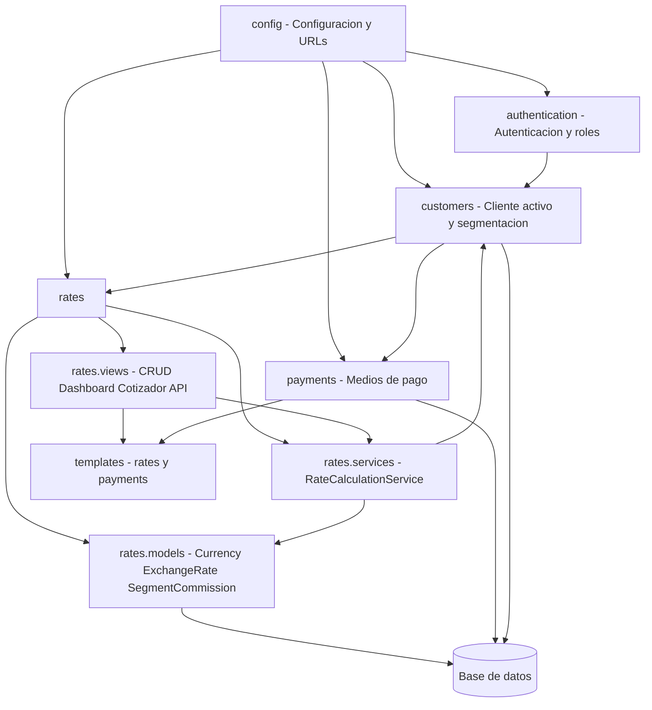

# Diagrama de Paquetes DIS PAQ 01 Actualizacion SCRUM 57

## 1. Proposito

Esta actualizacion incorpora la estructura real de los modulos `rates` y `payments`, y precisa que `comisiones` y `cotizador` pertenecen a `rates`. El diseno conserva la separacion entre presentacion, dominio, persistencia y contexto del cliente.

## 2. Diagrama de paquetes

## 3. Paquete rates

### Responsabilidad

Gestiona parametros financieros y simulaciones: monedas, tasas de cambio, historico, comisiones por segmento y cotizador neto.

### Contenido

| Componente | Responsabilidad |
|---|---|
| `models.py` | Define `Currency`, `ExchangeRate` y `SegmentCommission` con validaciones financieras. |
| `services.py` | Resuelve el cliente activo, consulta la tasa vigente y calcula la cotizacion neta. |
| `forms.py` | Valida datos de monedas, tasas, comisiones y parametros del cotizador. |
| `views.py` | Implementa CRUD, tablero, cotizador y endpoints JSON. |
| `urls.py` | Expone rutas bajo `/rates/`. |
| `admin.py` | Facilita la parametrizacion administrativa y asigna el usuario que actualiza tasas. |
| `tests.py` | Cubre modelo, servicio, formularios, vistas y APIs. |

### Submodulo conceptual comisiones

No existe como aplicacion Django separada. Se implementa mediante `SegmentCommission` y las vistas `SegmentCommission*` dentro de `rates`. Depende de `customers.Cliente.Segmentacion` para obtener los segmentos autorizados.

### Submodulo conceptual cotizador

Tampoco es una aplicacion independiente. Usa `RateCalculationService`, la vista `RateCalculatorView` y `CalculateNetRateApiView`. Recibe datos de `ExchangeRate` y `SegmentCommission`, pero no persiste una transaccion ni cambia una tasa.

## 4. Paquete payments

### Responsabilidad

Administra medios de pago de los clientes sin ejecutar la liquidacion financiera. La propiedad del recurso se resuelve con el cliente activo y protege las vistas contra acceso horizontal no autorizado.

### Contenido

| Componente | Responsabilidad |
|---|---|
| `models.py` | Define `PaymentMethod` y garantiza un medio predeterminado activo por cliente. |
| `forms.py` | Valida datos obligatorios y la consistencia entre predeterminado y activo. |
| `views.py` | Ofrece CRUD web, acciones de estado y API JSON. |
| `urls.py` | Expone rutas bajo `/payments/`. |
| `tests.py` | Verifica integridad, formularios, aislamiento por cliente e interfaces API. |

## 5. Dependencias permitidas

| Origen | Destino | Motivo |
|---|---|---|
| `rates.models` | `customers.models` | `SegmentCommission` usa las opciones de segmentacion de `Cliente`. |
| `rates.services` | `customers.models` | Resuelve el cliente activo y el segmento comercial. |
| `rates.views` | `rates.services` | Delega la matematica de cotizacion al servicio. |
| `payments.models` | `customers.models` | `PaymentMethod` pertenece a un cliente. |
| `payments.views` | `customers` | Filtra por cliente activo en cada operacion. |
| `config` | `rates`, `payments` | Incluye rutas de ambas aplicaciones. |

No se permite que `payments` dependa del motor de cotizacion para su CRUD actual. Si una transaccion futura necesita ambos paquetes, el orquestador debe ubicarse en `transactions` para evitar acoplamiento circular.

## 6. Interfaces expuestas

| Paquete | Interfaz | Proposito |
|---|---|---|
| `rates` | `/rates/calculator/` | Cotizador web autenticado. |
| `rates` | `/rates/api/calculate/` | Calculo JSON por GET o POST. |
| `rates` | `/rates/api/commissions/` | Lista de reglas de comision. |
| `rates` | `/rates/api/commissions/<segment>/` | Detalle de una regla por segmento. |
| `rates` | `/rates/dashboard/` y `/rates/api/history/` | Visualizacion e historial de cotizaciones. |
| `payments` | `/payments/` | Gestion web de medios de pago. |
| `payments` | `/payments/api/` y `/payments/api/<pk>/` | API JSON de medios de pago. |

## 7. Flujo entre paquetes

1. El usuario se autentica y `customers` determina el cliente activo.
2. El cotizador obtiene el segmento de ese cliente y solicita a `rates.models` la tasa vigente y la regla aplicable.
3. `RateCalculationService` entrega un resultado informativo a la vista o API de `rates`.
4. De forma independiente, `payments` permite al mismo cliente registrar o elegir un medio de pago para una futura liquidacion.
5. Un modulo transaccional posterior podra usar el resultado confirmado y un medio de pago elegido sin alterar los paquetes de parametrizacion.
