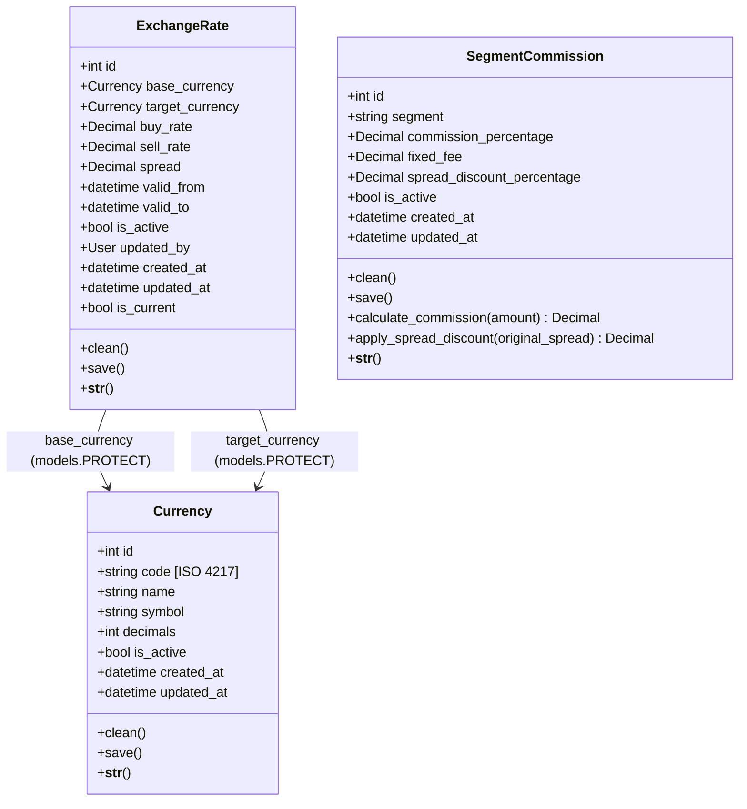

# Especificación Técnica: Modelos de Datos para Tasas de Cambio, Monedas y Comisiones (SCRUM-50)

## 📌 Metadatos de la Tarea

* **Código Jira:** SCRUM-50
* **Título:** Definición de Modelos de Datos para Monedas, Tasas de Cambio y Comisiones por Segmento (`rates`)
* **Sprint:** Sprint 2
* **Responsable:** Pablo Elizeche / Antigravity AI
* **Estado:** Finalizado
* **Rama:** `feature/SCRUM-50`

---

## 🎯 Objetivo y Alcance

El objetivo de esta tarea es dotar a la plataforma **Global Exchange** de un motor financiero transaccional robusto y parametrizable para la gestión de:
1. **Monedas y Divisas Internacionales (`Currency`):** Catálogo de monedas operativas con código ISO 4217, símbolo representativo, precisión decimal y control de activación.
2. **Tasas de Cambio y Cotizaciones (`ExchangeRate`):** Cotizaciones oficiales entre pares de divisas (`base_currency` y `target_currency`), con registro de tasas de compra y venta, cálculo automatizado e inmutable de margen cambiario (*spread*), control de vigencia temporal y auditoría de usuario.
3. **Comisiones y Políticas Cambiarias por Segmento (`SegmentCommission`):** Parámetros tarifarios diferenciados para los segmentos de clientes (`Cliente.Segmentacion`), contemplando porcentajes de comisión por operación, cargos fijos administrativos, bonificaciones porcentuales sobre el spread cambiario y métodos de cálculo dinámico.

---

## 🏛️ Arquitectura del Módulo `rates`

---

## 📋 Especificación de Modelos de Datos

### 1. `Currency` (Catálogo de Divisas)

| Campo | Tipo Django | Restricciones / Opciones | Descripción |
| :--- | :--- | :--- | :--- |
| `id` | `BigAutoField` | PK, Auto-incremental | Identificador único. |
| `code` | `CharField(3)` | `unique=True`, `db_index=True` | Código alfabético ISO 4217 (ej: `USD`, `PYG`, `EUR`, `BRL`). |
| `name` | `CharField(50)` | Requerido | Nombre oficial de la divisa (ej: `Dólar Estadounidense`). |
| `symbol` | `CharField(10)` | Requerido | Símbolo gráfico (ej: `$`, `₲`, `€`, `R$`). |
| `decimals` | `PositiveSmallIntegerField` | `default=2` | Cantidad de cifras decimales admitidas (0 para PYG, 2 para USD/EUR). |
| `is_active` | `BooleanField` | `default=True` | Estado operativo de la moneda en la plataforma. |
| `created_at` | `DateTimeField` | `auto_now_add=True` | Timestamp de creación. |
| `updated_at` | `DateTimeField` | `auto_now=True` | Timestamp de última modificación. |

* **Reglas de Normalización y Validación (`clean` / `save`):**
  * Limpieza de espacios en blanco en todos los campos de texto.
  * Conversión obligatoria del código a mayúsculas y verificación estricta de longitud exacta de 3 caracteres alfabéticos (`isalpha()`).

---

### 2. `ExchangeRate` (Tasas de Cambio y Cotizaciones)

| Campo | Tipo Django | Restricciones / Opciones | Descripción |
| :--- | :--- | :--- | :--- |
| `id` | `BigAutoField` | PK, Auto-incremental | Identificador único. |
| `base_currency` | `ForeignKey(Currency)` | `on_delete=models.PROTECT`, `related_name='base_exchange_rates'` | Moneda de referencia base (unidad cotizada, ej. USD). |
| `target_currency` | `ForeignKey(Currency)` | `on_delete=models.PROTECT`, `related_name='target_exchange_rates'` | Moneda destino o precio expresado (ej. PYG). |
| `buy_rate` | `DecimalField(18, 6)` | Requerido | Tasa a la cual la entidad compra la divisa base. |
| `sell_rate` | `DecimalField(18, 6)` | Requerido | Tasa a la cual la entidad vende la divisa base. |
| `spread` | `DecimalField(18, 6)` | `editable=False`, `default=0` | Diferencial de ganancia cambiaria (`sell_rate - buy_rate`). |
| `valid_from` | `DateTimeField` | `default=timezone.now` | Inicio de vigencia de la cotización. |
| `valid_to` | `DateTimeField` | `null=True`, `blank=True` | Expiración de la cotización (opcional). |
| `is_active` | `BooleanField` | `default=True` | Bandera de activación operativa. |
| `updated_by` | `ForeignKey(User)` | `null=True`, `blank=True`, `on_delete=models.SET_NULL` | Usuario operador/administrador responsable. |
| `created_at` | `DateTimeField` | `auto_now_add=True` | Timestamp de inserción. |
| `updated_at` | `DateTimeField` | `auto_now=True` | Timestamp de modificación. |

* **Reglas de Integridad y Validación Financiera (`clean` / `save`):**
  * `base_currency != target_currency`: No se permite cotizar una moneda contra sí misma.
  * `buy_rate > 0` y `sell_rate > 0`: Las tasas deben ser estrictamente positivas.
  * `sell_rate >= buy_rate`: Garantiza que no existan márgenes negativos de arbitraje no intencionales.
  * `valid_to > valid_from`: La fecha límite debe ser cronológicamente posterior a la fecha inicial.
  * **Cálculo Automático de Spread:** `spread = sell_rate - buy_rate` calculado automáticamente antes de la persistencia.
  * **Propiedad `is_current`:** Evalúa en tiempo real si `is_active=True`, `valid_from <= now()` y (`valid_to is None` o `valid_to >= now()`).

---

### 3. `SegmentCommission` (Comisiones por Segmento)

| Campo | Tipo Django | Restricciones / Opciones | Descripción |
| :--- | :--- | :--- | :--- |
| `id` | `BigAutoField` | PK, Auto-incremental | Identificador único. |
| `segment` | `CharField(3)` | `choices=Cliente.Segmentacion.choices`, `unique=True`, `db_index=True` | Segmento objetivo (`MINORISTA`, `MAYORISTA`, `CORPORATIVO`, `VIP`). |
| `commission_percentage` | `DecimalField(5, 2)` | `default=0.00` | Porcentaje sobre el volumen operado (0.00% a 100.00%). |
| `fixed_fee` | `DecimalField(12, 2)` | `default=0.00` | Costo o cargo fijo por operación. |
| `spread_discount_percentage` | `DecimalField(5, 2)` | `default=0.00` | Descuento o bonificación sobre el spread (0.00% a 100.00%). |
| `is_active` | `BooleanField` | `default=True` | Vigencia de la política de comisiones. |
| `created_at` | `DateTimeField` | `auto_now_add=True` | Timestamp de creación. |
| `updated_at` | `DateTimeField` | `auto_now=True` | Timestamp de actualización. |

* **Métodos de Cálculo:**
  * `calculate_commission(amount: Decimal) -> Decimal`: Retorna `(amount * commission_percentage / 100) + fixed_fee` si la regla está activa y `amount > 0`.
  * `apply_spread_discount(original_spread: Decimal) -> Decimal`: Retorna el spread reducido tras aplicar `spread_discount_percentage` (mínimo `0.000000`).

---

## 🛠️ Panel de Administración (`rates/admin.py`)

Se implementaron clases `ModelAdmin` especializadas con:
- `CurrencyAdmin`: Búsqueda por código, nombre y símbolo; filtro por estado activo; edición rápida en línea (`list_editable=('is_active',)`).
- `ExchangeRateAdmin`: Filtros por monedas y vigencia temporal (`date_hierarchy='valid_from'`); lectura de spread calculado; captura automática del usuario logueado en `save_model()`.
- `SegmentCommissionAdmin`: Edición directa de tarifas y porcentajes desde la grilla con `list_editable`.

---

## 🧪 Pruebas Unitarias y Cobertura

Se construyó una suite de pruebas unitarias exhaustiva en `rates/tests.py` que incluye:
1. Pruebas de catálogo y normalización de divisas (`CurrencyModelTest`):
   - Creación, valores por defecto e ISO de 3 caracteres.
   - Conversión automática a mayúsculas y recorte de espacios.
   - Rechazo de códigos no alfabéticos o de longitud distinta a 3.
   - Verificación de restricción de unicidad.
2. Pruebas de tasas de cambio (`ExchangeRateModelTest`):
   - Cálculo automático del spread cambiario.
   - Rechazo de pares idénticos (ej. USD/USD).
   - Rechazo de tasas negativas o cero.
   - Rechazo de tasa de venta inferior a la de compra.
   - Validación cronológica de rangos de vigencia.
   - Evaluación del estado dinámico `is_current`.
   - Protección contra borrado en cascada de monedas activas (`models.PROTECT`).
3. Pruebas de comisiones por segmento (`SegmentCommissionModelTest`):
   - Restricción de unicidad por segmento.
   - Validación de rangos permitidos (0.00% a 100.00%, cargos fijos no negativos).
   - Cálculo de comisión fija y porcentual con diferentes volúmenes y reglas inactivas.
   - Bonificación de spread y control de límites.
4. Pruebas de Django Admin (`RatesAdminTest`):
   - Asignación automática del usuario en `save_model`.

### Resultados de Ejecución
- **Tests ejecutados:** 117 tests en la suite total (21 nuevos de `rates`).
- **Tasa de éxito:** 100% (117 pasados, 0 fallos, 0 errores).
- **Cobertura de la app `rates`:** **100%** de líneas de código cubiertas.
